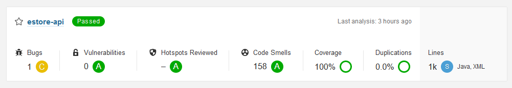

# ItsTeamTwo e-Store Design Documentation

## Team Information

- Team name: itsTeamTwo
- Team members
  - Macy So
  - Chen Guo
  - Greg Lynskey 

## Executive Summary

The Overpriced Grocery store is where you can find your daily needs, and our prices are far above our competitors. Our E-Store allows customers to order their products from home via the cart function. If a customer is not happy with a product, they can leave a written review to inform our administrators what products the customers actually want. The e-store functions on a REST API backend written in Java 11 which is then controlled by an angular frontend. Relevant data persists in a JSON file.

### Purpose

The product should function like a normal online store. Our primary user would be the customer, who can use the cart function to add or remove desired items then order once they are happy with their order. Another prime user would be the admin/store owner where they can add or remove products from the store, they can also read the customers reviews to better inform them of how their products are performing.

### Glossary and Acronyms

> _Provide a table of terms and acronyms._

| Term | Definition                      |
| ---- | ------------------------------- |
| SPA  | Single Page                     |
| DAO  | Data Access Object              |
| UI   | User Interface                  |
| REST | Representational state transfer |

## Requirements

This section describes the features of the application.

- User - Login - Admin/Customer
- Customer - add, remove checkout, browse products
- Admin - add, remove, edit products

### Definition of MVP

MVP is a product with enough features to attract early-adopter customers and validate a product idea early in the product development cycle

### MVP Features

- User - Login admin / customer
- Admin add product, edit product, remove product
- Customer browse product, see product details, add/remove/checkout cart

### Roadmap of Enhancements

- Add product to wishlist
- Admin are able to add product images
- Leave reviews - star reviews + written reviews

## Application Domain

Our target market are those who want to purchase wacky grocery store items for outrageous prices. 

First, we have a inventoryController that controller the functionality of the admin function, including get a single product, create new product, get a list of products, delete product, search product and update product. This is where we set up the HTTP status. It will be linked with the Product class itself, and the inventoryDAO class as well. In the Product class, we will be storing each other with an id, productName, price and it's description. Within the class, we will have fields such as getting the id, getting the name, getting the price, description and setting names, prices and description. This is to support the admin functionality of edit, add and remove product. The inventoryDAO is basically a interface for inventoryFileDAO. In the InventoryDAO, there is function such as getProduct, findProducts, getProducts, createProduct, updateProduct and deleteProduct. And this is closely linked with InventoryFileDAO as there is where we implement the functionality.

## Architecture and Design

This section describes the application architecture.

### Summary

The following Tiers/Layers model shows a high-level view of the webapp's architecture.

The e-store web application, is built using the Model–View–ViewModel (MVVM) architecture pattern.

The Model stores the application data objects including any functionality to provide persistance.

The View is the client-side SPA built with Angular utilizing HTML, CSS and TypeScript. The ViewModel provides RESTful APIs to the client (View) as well as any logic required to manipulate the data objects from the Model.

Both the ViewModel and Model are built using Java and Spring Framework. Details of the components within these tiers are supplied below.

### Overview of User Interface

The user is able to view the site from a few different views. If they are a customer they will see a full list of products, and will have access to the cart functionality. If they want to see more about an item they can click on the product description. If they are an admin then they have the ability to update the product inventory and read customer reviews.

### View Tier

The View Tier UI, we have the shopping-cart components and the admin component. We also have a shared component folder where the login, register, and other shared elements such as header, and footer. The shopping cart component only focus on the customer functionality, including browsing product, add product to cart, view product, and checkout cart. The admin component, have the admin functionality such as the add product, remove products and edit products.

### ViewModel Tier

The controllers for Cart, Inventory, Review, and User all help connect the front end to the backend. When the frontend has a request, it calls one of the backend methods in the controller that will then mutate data and return an updated/modified version of this data.

### Model Tier

The model tier functions using a REST API containing user and product data. The model connects to the front end and displays the current data as requested by the frontend view model. The product data is stored in an inventory, and is accessed by the frontend via a controller connected to a file data access object, which is the current method of storing data. There are also models for the user, review, and cart data.

### Static Code Analysis/Design Improvements

The backend estore api performs good in overall except a bug that is blocks should be synchronized on "private final" fields.

This is duplications analysis for estore view/frontend.
There are duplications on 62 lines that causes by the below two files.

Both admin and product-list components require to call products services to make http requests, therefore there are duplicated functions.
It can be improved with expanding code for product service to support functionalities the two components need. Or to create a shared typescript file to place shared code for components.

---

The zero coverage is because no testing covers the frontend.
But it is necessary to make up testings in considering of maintainability.

---

This is a hotspot warning for insecure http protocol that causes the quality gate status failed.
For avoiding attacking, the url should use other secure protocol if the project applied on real environment.

---

These bugs are related to normative use of html, these ones can be fixed shortly.

#### Design Improvements

In addition to flags and recommendations from static code analysis, there are some design principles need to consider between frontend and backend.

As principle of GRASP Controller, there are three separations between model, api, and ui. In this project, we implemented ui firstly, then started to make model and api to enable ui function. There are some API functions implemented in the UI file, and the API file only contains basic CRUD HTTP requests. for future refactoring, we may consider moving the API part in the UI file to the API file to make the separation of API and UI clearer.

And for Open/Closed principle, we maybe better to keep the backend code as simple as possible because it is hard to extend functionality in the MVC that is an architectural pattern. Besides the necessary functions to handle the data, we should move the application-related functions to the front-end where it is easier to implement dependency injection. For example, to get a list of products based on price, name, and description respectively, if we put all these functions in the backend, we need to create an additional address, but in the frontend, we only need to get all the products and filter them according to the conditions. This also does not need to modify the basic code.

## Testing

Testing was performed on the product inventory, review, cart and user backend. 

### Acceptance Testing

1. Browse Product - Passed
  - Customer can browse the product list by searching or scrolling on the page
2. Add Product to Cart - Passed
  - Customer can add products they search for/find on the main page to their cart
3. Remove Product from Cart - Passed
  - Customer can remove a given product from their cart
4. Checkout Product from Cart - Passed
  - Customer can press the checkout button to clear their card (Simulating a checkout)
5. View Product Details - Passed
  - Customer can click on the product details page to view more about the product
6. Admin Add Product - Passed
  - Admins can log in and add a product to the product list
7. Admin Edit Product - Passed
  - Admins can edit product information (Name, Price, Description, Photo)
8. Admin Remove Product - Passed
  - Admins can delete a product
9. Customer see past order - Fail
  - Not Implemented
10. Customer able to review (star rating + written reviews) - Fail
  - Not Implemented
11. Wishlist - Passed
  - Customers can heart a product to save for later

* See acceptance test plan for more details.

### Unit Testing and Code Coverage

The general code testing strategy in the backend corresponds to the following, if a method has an outcome, the unit tests will run to recreate that outcome. For most controller tier methods that included all the HTTP RequestMappings to be tested. Most methods had three unit tests, one resulting in OK (200) or CREATED(201), one with NOT_FOUND(404), and one with INTERNAL_SERVER_ERROR (500). All these outcomes are possible with the controller methods, so the tests validated that the if else logic along with the try catch error handling worked as expected.

